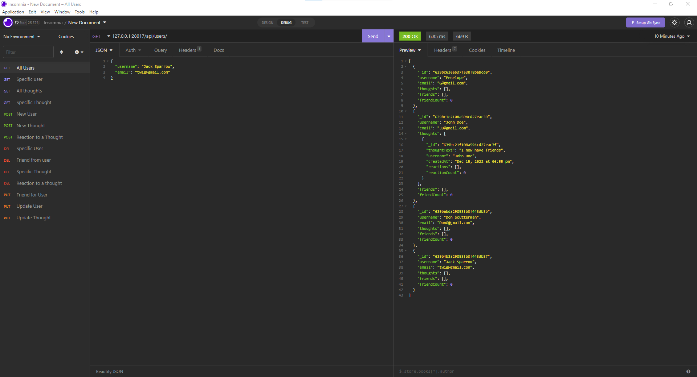

# Social-Netwrok-API

This is a social network app where users can add friends and share thoughts along with reactions to thoughts.

### Github : https://github.com/KMParrish/Social-Network-API

### Walkthrough Video:
https://app.castify.com/watch/9547500b-621a-4dde-aa14-14a3cc285f7d


## Description
An API for a social network web application, where may share and react to each other's thoughts.


## User Story
```
- AS A social media startup
- I WANT an API for my social network that uses a NoSQL database
- SO THAT my website can handle large amounts of unstructured data
```


## Usage
- Application allows user to add accounts with usernames and emails.
- The user is able to create, read, update and delete(CRUD) users.
- This application allows the user to add friends and show many friends I have.
- This application allows the user to create and find reactions and thoughts.
- User is able to delete reactions, thoughts and remove friends.


## Screenshots



## Technologies Used
<p><a href="https://www.mongodb.com/">MongoDB</a></p>
<p><a href="https://www.npmjs.com/package/mongoose">Mongoose</a></p>
<p><a href="https://nodejs.org/">Node.js</a></p>
<p><a href="https://www.npmjs.com/package/express">Express.js</a></p>
<p><a href="https://www.npmjs.com/package/moment">Moment.js</a></p>


## Contributor:
Kyle Parrish